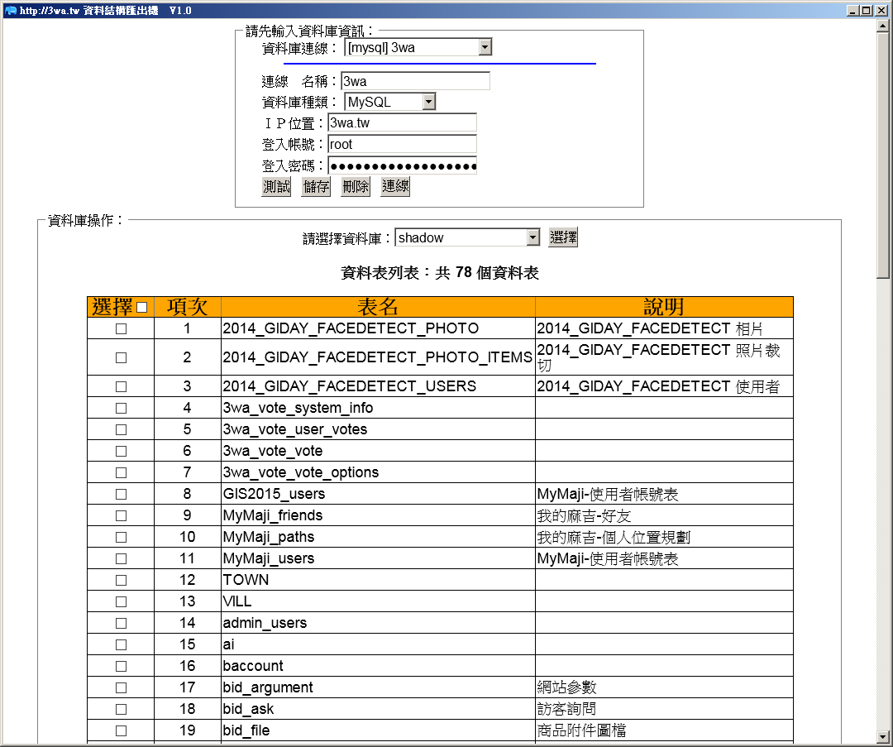
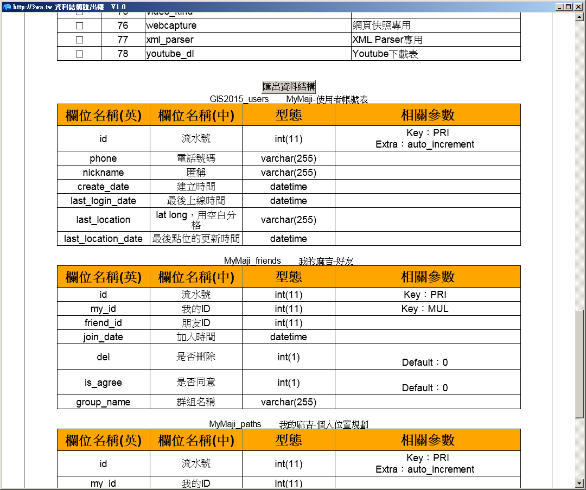

這是一套用 php-desktop 作為基底寫的資料庫資料結構匯出機
-------------------------------------------------
此程式是方便工程師提供 Table schema 給 SA，點一點就可以匯出  
來，不用花很多時間維護 word、excel 檔案了 :D  
 
 
程式說明：http://3wa.tw 資料庫資料結構匯出機  
作者：羽山秋人                        
版本：V1.3  
版權：GPL & MIT 喜歡就拿去用吧  
支援作業系統： 
（✔）Win7 64  
（✔）Win8 64  
（✔）Win10 64  
其他不知道... 
 
目前支援資料庫類型： 
（✔）MySQL、同MariaDB  
（✔）MSSQL  
（✔）PostgreSQL  
（✔）Oracle  
（✔）SQLite  
 
執行方法： 
　　下載後，執行 run.exe 即可！ 
 
注意事項： 
　　資料庫儲存後預設是放在 C:\temp\db.data  
 
截圖： 
 

 
<b>使用者可以自己設定主機的連線（當然資料庫要允許連才行）</b>
 

 
<b>可以匯出資料結構～讚啦，接下來就可以複製到 Word 作成文件了～</b>
